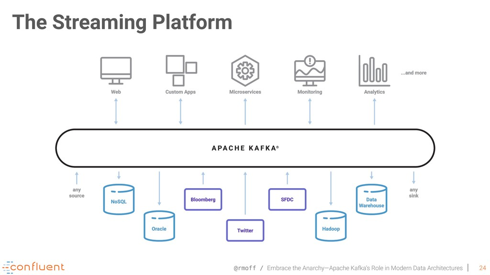

# Apache Kafka

Apache Kafka is an open-source distributed event streaming platform developed by LinkedIn as a high-throughput message broker written in java and scala. It is capable of handling real-time data with high throughput and low latency.

## What is Event Streaming?

Event streaming refers to capturing data in real-time from event sources such as databases, mobile devices, sensors, and cloud services. These data are later retrieved for processing and reacting in real-time. Event streams are routed to different destinations as per requirement, therefore ensuring the continuous flow of information at the right place.

## Concept and Terminologies

 

An **event** can be anything that happened in real-life it is also called a **record** or **message**. An event consists of a key, value, timestamp, and optional metadata headers. Kafka can be configured to store these records for any length of time via pre-topic configuration settings. The performance of Kafka is almost constant regardless of the size of the data.

> ### Example of Event
> - Event key: 'order'   return
> - Event value: 'iPhone 13'
> - Event time-stamp: 'Jan 24, 2021 at 02:00'

**Producers** are client applications that publish events. Kafka follows the publish-subscribe model producers publish the events under a topic. A **Topic** is similar to a directory in a file system and events as files in the directory. **Consumers** are programs that utilize events and get insights consumers can access records in a topic by subscribing to that topic. Kafka ensures each message is processed only once by the consumer,
A consumer can subscribe to one or more topics.
Consumers and producers are not aware of each other's existences and can function independently, thus achieving high scalability. Events with the same key written to the same **partition** consumer will process the events exactly in the same order.

## Use Cases

### 1. Tracking Website Activity

Kafka can reduce the user activity tracking pipeline to a set of real-time publish-subscribe feeds. Site activity searches, page views, or other user actions are published to central topics with one topic per activity type. These feeds are available to subscribers of that topic for real-time monitoring, real-time processing, and data warehousing.

### 2. Messaging

Kafka is a good alternative for traditional messaging systems such as Active MQ and Rabbit MQ Since it has better throughput, built-in partitioning, replication, and fault-tolerance.

### 3. Event Sourcing

Event sourcing is a style of application design where state changes are logged as a time-ordered sequence of records. Kafka's support for very large stored log data makes it an excellent backend for an application built in this style.

### 4. Metrics

Kafka is often used for operational monitoring data. This involves aggregating statistics from distributed applications to produce centralized feeds of operational data.

### 5. Log Aggregation

Kafka is well suited for log aggregation since publishers and consumers are decoupled very good level of abstraction is maintained in the system.

### 6. Commit Log

Since Kafka can retain the records and retrieve them as often as needed it can serve as a commit log for failed nodes.

## Getting started with  Apache kafka

### Install Apache Kafka

```bash
$ tar -xzf kafka_2.13-3.1.0.tgz
$ cd kafka_2.13-3.1.0
```
---

### Start Kafka ENVIRONMENT

```bash
#Start the ZooKeeper service
#Note: Soon, ZooKeeper will no longer be required by Apache Kafka.
$ bin/zookeeper-server-start.sh config/zookeeper.properties
```

Open another terminal session and run:
```bash
#Start the Kafka broker service
$ bin/kafka-server-start.sh config/server.properties
```
---

### CREATE A TOPIC TO STORE YOUR EVENTS

```bash
$ bin/kafka-topics.sh --create --topic quickstart-events --bootstrap-server localhost:9092
```
```bash
$ bin/kafka-topics.sh --describe --topic quickstart-events --bootstrap-server localhost:9092
Topic:quickstart-events  PartitionCount:1    ReplicationFactor:1 Configs:
    Topic: quickstart-events Partition: 0    Leader: 0   Replicas: 0 Isr: 0
```
---

### WRITE SOME EVENTS INTO THE TOPIC

```bash
$ bin/kafka-console-producer.sh --topic quickstart-events --bootstrap-server localhost:9092
This is my first event
This is my second event
```
You can stop the producer client with Ctrl-C at any time.

---

### READ THE EVENTS

```bash
$ bin/kafka-console-consumer.sh --topic quickstart-events --from-beginning --bootstrap-server localhost:9092
This is my first event
This is my second event
```
---

### TERMINATE THE KAFKA ENVIRONMENT

Stop the producer and consumer clients with Ctrl-C, if you haven't done so already.
Stop the Kafka broker with Ctrl-C.
Lastly, stop the ZooKeeper server with Ctrl-C.
```bash
$ rm -rf /tmp/kafka-logs /tmp/zookeeper
```

## References

1. [Official Apache Kafka page](https://kafka.apache.org/)

2. [Youtube video](https://youtu.be/FKgi3n-FyNU)

3. [Amazon Web Services](https://aws.amazon.com/msk/what-is-kafka/)

